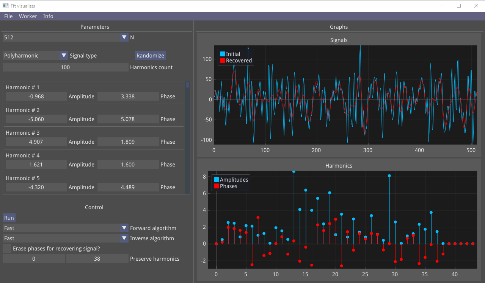
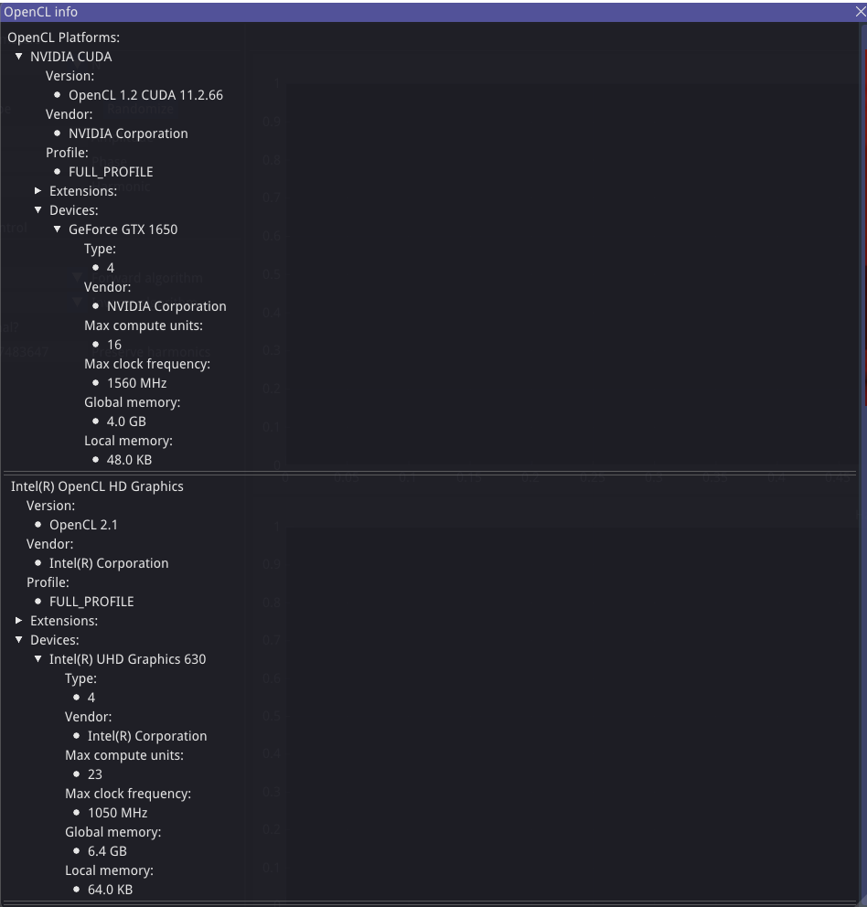

# Fast Fourier Transform visualization

Program written on C++ with OpenCL to learn how to use FFT with different signals



##What is this?

Application create mainly for OpenCL learning purpose.
Applies forward and inverse [DFT](https://en.wikipedia.org/wiki/Discrete_Fourier_transform) or [FFT](https://en.wikipedia.org/wiki/Fast_Fourier_transform) to harmonic or polyharmonic signal.
In math notation:
* DFT and inverse DFT
  <pre><code>X(j) = &sum; x(i) * e<sup>+2&pi;ij/N</sup> / N
  X(j) = &sum; X(i) * e<sup>-2&pi;ij/N</sup></code></pre>

Created with:
* [SDL2](https://www.libsdl.org/)
* [ImGui](https://github.com/ocornut/imgui/) with [ImPlot](https://github.com/epezent/implot)
* [OpenCL](https://wikipedia.org/wiki/OpenCL) v1.2

##How to build

Requirements:
* OpenGL >= 4.2, or otherwise:
    * change **_kOpenGlVersion_** and **_kGlslVersion_** in [application_configuration.h](./app/application_configuration.h))
    * change **_API_** version in [glad2_loader/CMakeLists.txt](./3rd_party/glad2_loader/CMakeLists.txt)
* C++ compiler supporting C++20 standard
* CMake >= 3.15
    * otherwise, try change **_VERSION_** in [CMakeLists.txt](./CMakeLists.txt)
* Installed [SDL2](https://www.libsdl.org/download-2.0.php) library
* Installed OpenCL environment:
    * for AMD &mdash; [AMD Accelerated Parallel Processing SDK](https://en.wikipedia.org/wiki/AMD_APP_SDK)
    * for Nvidia &mdash; [CUDA toolkit](https://developer.nvidia.com/CUDA-toolkit-Archive)
    * for Intel &mdash; [Intel SDK for OpenCL](https://software.intel.com/content/www/us/en/develop/tools/opencl-sdk.html)
    
---
**Warning!:** Project dependencies is almost **100 MB**

---

Clone project with submodules (choose one of the repositories):
```shell script
git clone https://github.com/ValeryKameko/fast-fourier-transform-visualization --recurse-submodules
git clone https://gitlab.com/ValeryKameko/fast-fourier-transform-visualization --recurse-submodules
```
Build CMake project:
```shell script
cd    ./fast-fourier-transform-visualization
mkdir ./cmake-build-release
cd    ./cmake-build-release
cmake .. -DCMAKE_BUILD_TYPE=Release
```

To run application:
```shell script
cd ./bin

# for WINDOWS
./fast-fourier-transform-visualization.exe

# for Linux
./fast-fourier-transform-visualization
```

Tested on:
* Windows (GNU GCC 9.0 MinGW, CMake 3.15, OpenGL 4.6)
    + Nvidia CUDA 11.2 + OpenCL 1.2
    + Intel SDK + OpenCL 2.1


